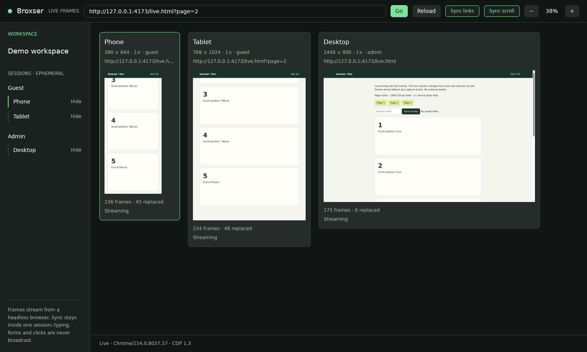

# Broxser

Workspace browser internal untuk developer, dibangun dengan **Rust + GPUI + Helium**.
Target pertama **Linux**. Buka satu URL pada beberapa viewport dan session, lalu lihat
serta gunakan halamannya dari satu window native.

**Status: spike M1.** Desktop menampilkan **frame live** dari Helium headless (CDP
screencast) untuk setiap device, dengan URL bar, reload, input pointer/wheel/keyboard
dan sync link/scroll opt-in di dalam satu session. Ini frame streaming ke window
native, bukan browser tertanam: IME, clipboard halaman, popup, download, permission,
dialog JavaScript dan aksesibilitas belum didukung, dan frame device DPR>1 tiba pada
resolusi CSS. Belum ada persistent login, DevTools panel atau console aggregator.
Ini belum pengganti Sizzy. Mode capture statis tetap tersedia lewat `--static`.

Masalah halaman lambat yang dulu menghasilkan `net::ERR_ABORTED` sudah dijelaskan:
uBlock Origin bawaan Helium berjalan di setiap BrowserContext dan me-reload tab.
Profil privat Broxser kini mematikannya di context session, capture menolak jalan
bila ada halaman ekstensi di sana, dan navigasi tidak pernah diulang otomatis.
Lihat [ADR 0004](docs/adr/0004-helium-bundled-blocker-in-session-contexts.md) dan
[catatan verifikasi](docs/validation.md).



Gambar di atas diambil dari window X11 (Xvfb, Vulkan software) di lingkungan cloud:
phone mengikuti link "Page 2" dan scroll, tablet pada session yang sama ikut, desktop
pada session `admin` tidak. Mode statis dari sesi Wayland awal: [preview.png](docs/images/preview.png).

## Jalankan di Linux x86_64

Prasyarat: Rust melalui rustup, compiler C/C++, clang, cmake, pkg-config, development
libraries X11/Wayland, xkbcommon, fontconfig, OpenSSL, dan Vulkan driver yang bekerja.
Toolchain repo dipin ke Rust 1.98.1. Python 3, curl dan tar/xz dipakai helper setup.
Build pertama GPUI mengunduh banyak dependensi; gunakan `-j 2` pada laptop 16 GB.

```bash
# Dari root repo; mengunduh Helium portable resmi dengan verifikasi SHA-256.
bash scripts/fetch-helium.sh
export BROXSER_HELIUM_BIN="$PWD/.local/helium/helium"

# Terminal pertama: halaman uji lokal tanpa external assets.
bash scripts/serve-fixture.sh
```

Di terminal kedua:

```bash
export BROXSER_HELIUM_BIN="$PWD/.local/helium/helium"
cargo run --locked -p broxser-desktop -j 2 -- \
  --workspace examples/workspace.json --url http://127.0.0.1:4173/live.html
```

Membuka workspace memuat URL-nya sekali di setiap device. `live.html` berubah empat
kali per detik sehingga pembaruan terlihat tanpa tombol capture; `index.html` tetap
deterministik untuk capture statis.

| Aksi | Perilaku |
| --- | --- |
| `Ctrl+L`, ketik, `Enter` / **Go** | Navigasi semua device satu kali; tanpa skema diawali `http://` |
| Klik device | Memilih device; pointer dan wheel ke device di bawah kursor |
| Keyboard | Ke device terpilih yang terlihat; `Ctrl+Q/R/L` tetap pintasan Broxser |
| **Reload** / `Ctrl+R` | Reload device terpilih saja |
| **Sync links** / **Sync scroll** | Opt-in, hanya antar-device terlihat dalam session yang sama; link memerlukan aktivasi tepercaya dan navigasi yang cocok |
| **Hide** di sidebar | Menghentikan stream dan input; memilih device terlihat lain, atau tanpa target keyboard bila semuanya disembunyikan |
| `+` / `−` | Skala tampilan; frame diminta sebesar ukuran tampilan |
| **Restart runtime** | Muncul setelah browser berhenti; memulihkan konfigurasi, tidak memutar ulang aksi |
| `Ctrl+Q` / tutup window | Menunggu browser berhenti dan profil dihapus |

Mode statis: tambahkan `--static`, lalu **Capture previews** atau `Ctrl+R`; opsi
`--capture-on-start` hanya untuk mode ini. Menutup window saat capture berjalan
membatalkannya dan menunggu cleanup (sekitar setengah detik). Jika proses Broxser
dibunuh (SIGTERM/SIGKILL) atau crash, pembersihan tidak berjalan dan browser dapat
tertinggal. URL dapat diganti lewat `--url http://localhost:3000` atau file workspace.

Sync link memakai observer terisolasi, bukan asumsi bahwa setiap navigasi setelah
mengetik berasal dari pengguna. Link lambat tetap dapat tersinkron; URL melebihi
batas validasi ditolak untuk sync tanpa dipotong. Redirect ke URL berbeda, link
subframe, download dan pembukaan tab baru belum dicakup kontrak sync ini.
Lihat [ADR 0006](docs/adr/0006-trusted-link-intent-and-hidden-input.md).

Helium juga dapat berasal dari instalasi tim: set `BROXSER_HELIUM_BIN` ke executable
tersebut. Tidak ada fallback Chromium diam-diam. `--browser /usr/bin/chromium`
tersedia untuk diagnosis eksplisit; hasilnya harus disebut Chromium, bukan bukti
kompatibilitas Helium. AppImage perlu bisa dieksekusi di distro tersebut; helper
menggunakan tar portable agar tidak memerlukan FUSE atau instalasi sistem.

## CLI untuk otomatisasi

```bash
cargo run --locked -p broxser-cli -- init workspace.json
cargo run --locked -p broxser-cli -- validate workspace.json
cargo run --locked -p broxser-cli -- doctor
cargo run --locked -p broxser-cli -- capture \
  --workspace workspace.json --url http://localhost:3000 \
  --output artifacts/captures
```

`init` menolak menimpa file yang sudah ada. `doctor` hanya memeriksa discovery;
jalankan capture untuk menguji kompatibilitas. Setiap capture menghasilkan subfolder
unik berisi PNG per device dan `report.json` setelah semua capture berhasil.
Output gagal dapat menyisakan PNG parsial, tanpa report sukses untuk run itu.

`report.json` mencatat browser product, versi CDP, session dan ukuran piksel PNG
aktual. Emulasi mobile mengatur viewport/touch, tidak mengubah Chromium menjadi
Safari. Nama session `Admin` atau `Guest` hanya label, bukan login otomatis.
Session bersifat sementara: dua device dengan ID session sama berbagi cookie dalam
satu capture; refresh membuat session baru. Halaman di session Broxser dirender tanpa
content blocker bawaan Helium; fitur privasi Helium lain tetap aktif. Core dump
kernel dari Broxser dan browser-nya tidak memuat isi memori; laporan crash Chromium
disimpan di profil privat dan ikut terhapus.

## Isi repo

| Path | Tanggung jawab |
| --- | --- |
| `crates/broxser-core` | Workspace v1, validasi, atomic save dan aturan sync tanpa UI/browser |
| `crates/broxser-engine` | Owned Helium process, CDP, session context, PNG capture dan live session (screencast, input, sync) |
| `crates/broxser-desktop` | Shell GPUI: frame live, URL bar, input, sync, status; mode capture statis |
| `crates/broxser-cli` | Init, validate, doctor dan export capture |
| `examples/` | Workspace contoh, fixture responsif (`index.html`) dan fixture live (`live.html`) |
| `runtime/` | Baseline Helium resmi beserta checksum |
| `docs/` | System Design, ADR, roadmap dan catatan verifikasi |
| `scripts/` | Unduh Helium, fixture server, `check.sh` dan pemeriksaan window X11 |

GPUI dipin ke `0.2.2`; baseline Helium Linux adalah `0.18.1.1`. Pin berguna untuk
reproduksi, lalu harus diperbarui mengikuti security review. Binary tidak masuk Git.
Tidak ada code, aset, atau file DMG Sizzy di repo.

## Verifikasi

```bash
bash scripts/check.sh

# Tes live memakai HTTP fixture milik tes pada port acak dan root profil unik.
# Jalankan sebagai user biasa: Chromium menolak root tanpa --no-sandbox.
BROXSER_TEST_BROWSER="$PWD/.local/helium/helium" \
  cargo test --locked -p broxser-engine -- --ignored --nocapture
```

Suite live mencakup piksel/isolasi session, load timeout, cancel saat request aktif,
kegagalan parsial tanpa retry, `live_slow_page_reproducer`, serta live session: frame,
input per device, sync dalam session tanpa loop/replay, batas frame, crash dan exit
browser. Reproducer dapat diulang dengan `BROXSER_REPRO_ITERATIONS`,
`BROXSER_REPRO_DELAY_MS`, dan `BROXSER_REPRO_BASELINE=1` untuk membandingkan perilaku
sebelum perbaikan.

Pemeriksaan window X11 (sesi desktop atau Xvfb, perlu `xdotool`) membuka mode live,
menutupnya, lalu menutup capture statis saat request ditahan, dan gagal bila ada
proses browser atau profil yang tertinggal:

```bash
cargo build --locked -p broxser-desktop
DISPLAY=:0 bash scripts/desktop-smoke.sh
```

Default `cargo test` menguji core/engine/CLI tanpa memerlukan desktop; tes lifecycle
engine memakai fake browser dan fake CDP sehingga tidak perlu Helium. GPUI
dikompilasi terpisah dan diuji dengan window nyata. CI menjalankan compile, test dan
seluruh suite live Helium.
Catatan hasil lokal dan batas pengujian berada di [docs/validation.md](docs/validation.md).

Jika sandbox browser gagal, periksa dukungan user namespaces/AppArmor dan paket
runtime distro. **Jangan menambahkan `--no-sandbox`.** Pesan gagal startup dapat
terjadi sebelum CDP tersedia; coba executable yang sama pada terminal dengan profil
uji tersendiri untuk melihat diagnosis upstream. Tidak perlu mengubah desktop config.

## Desain dan horizon perawatan

Baca [System Design](docs/system-design.md), [dokumen Word](docs/system-design.docx),
[ADRs](docs/adr/0001-gpui-and-external-helium.md), [Security](SECURITY.md) dan
[upstream notices](NOTICE.md). Rencana sepuluh tahun mengandalkan core kecil,
engine yang dapat diganti, format data portabel, update rutin serta maintainer utama
dan backup; bukan janji bahwa API framework hari ini akan tetap sama sampai 2036.

Urutan berikutnya: jalankan checklist desktop manual M1 di Wayland dan GPU nyata;
lengkapi workflow harian dan recovery (M2); jalankan pilot tim; baru evaluasi
penggantian subscription.
Biaya maintenance internal perlu dibandingkan dengan penghematan seat berdasarkan
data perusahaan. Tidak ada layanan cloud atau subscription Broxser yang diwajibkan.

Referensi: [Sizzy](https://sizzy.co/), [GPUI](https://gpui.rs/),
[Helium](https://helium.computer/), [CDP](https://chromedevtools.github.io/devtools-protocol/).
