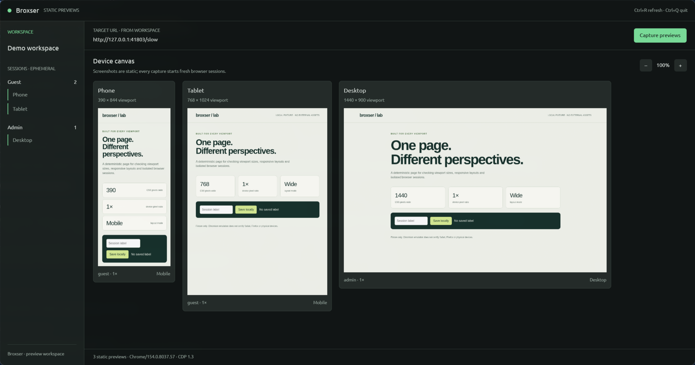

# Broxser

Workspace browser internal untuk developer, dibangun dengan **Rust + GPUI + Helium**.
Target pertama **Linux**. Repo ini adalah fondasi yang bisa dijalankan: buka satu URL
pada beberapa viewport, pisahkan session, lalu tampilkan capture di canvas native.

**Status: foundation / integration spike.** Preview berupa screenshot statis.
Belum ada browser interaktif tertanam, persistent login, DevTools panel, atau sync
klik/scroll di UI. Ini belum pengganti lengkap Sizzy.

Ada batasan runtime yang belum selesai: halaman lambat sesekali menghasilkan
`net::ERR_ABORTED` saat beberapa target dibuka. Aplikasi melaporkan kegagalan dan
memerlukan refresh eksplisit. Lihat [catatan verifikasi](docs/validation.md).



## Jalankan di Linux x86_64

Prasyarat: Rust melalui rustup, compiler C/C++, clang, cmake, pkg-config, development
libraries X11/Wayland, xkbcommon, fontconfig, OpenSSL, dan Vulkan driver yang bekerja.
Toolchain repo dipin ke Rust 1.98.1. Python 3, curl dan tar/xz dipakai helper setup.
Build pertama GPUI mengunduh banyak dependensi; gunakan `-j 2` pada laptop 16 GB.

```bash
# Dari root repo; mengunduh Helium portable resmi dengan verifikasi SHA-256.
bash scripts/fetch-helium.sh
export BROXSER_HELIUM_BIN="$PWD/.local/helium/helium"

# Terminal pertama: halaman uji lokal tanpa external assets.
bash scripts/serve-fixture.sh
```

Di terminal kedua:

```bash
export BROXSER_HELIUM_BIN="$PWD/.local/helium/helium"
cargo run --locked -p broxser-desktop -j 2 -- \
  --workspace examples/workspace.json --capture-on-start
```

Klik **Capture previews** atau `Ctrl+R` untuk capture baru; `+`/`−` mengubah ukuran
preview; canvas dapat di-scroll; `Ctrl+Q` menutup window. Penutupan normal saat
capture berjalan menunggu job selesai agar browser child dapat dibersihkan.
URL dapat diganti lewat `--url http://localhost:3000` atau file workspace.

Helium juga dapat berasal dari instalasi tim: set `BROXSER_HELIUM_BIN` ke executable
tersebut. Tidak ada fallback Chromium diam-diam. `--browser /usr/bin/chromium`
tersedia untuk diagnosis eksplisit; hasilnya harus disebut Chromium, bukan bukti
kompatibilitas Helium. AppImage perlu bisa dieksekusi di distro tersebut; helper
menggunakan tar portable agar tidak memerlukan FUSE atau instalasi sistem.

## CLI untuk otomatisasi

```bash
cargo run --locked -p broxser-cli -- init workspace.json
cargo run --locked -p broxser-cli -- validate workspace.json
cargo run --locked -p broxser-cli -- doctor
cargo run --locked -p broxser-cli -- capture \
  --workspace workspace.json --url http://localhost:3000 \
  --output artifacts/captures
```

`init` menolak menimpa file yang sudah ada. `doctor` hanya memeriksa discovery;
jalankan capture untuk menguji kompatibilitas. Setiap capture menghasilkan subfolder
unik berisi PNG per device dan `report.json` setelah semua capture berhasil.
Output gagal dapat menyisakan PNG parsial, tanpa report sukses untuk run itu.

`report.json` mencatat browser product, versi CDP, session dan ukuran piksel PNG
aktual. Emulasi mobile mengatur viewport/touch, tidak mengubah Chromium menjadi
Safari. Nama session `Admin` atau `Guest` hanya label, bukan login otomatis.
Session bersifat sementara: dua device dengan ID session sama berbagi cookie dalam
satu capture; refresh membuat session baru.

## Isi repo

| Path | Tanggung jawab |
| --- | --- |
| `crates/broxser-core` | Workspace v1, validasi, atomic save dan aturan sync tanpa UI/browser |
| `crates/broxser-engine` | Owned Helium process, CDP, session context dan PNG capture |
| `crates/broxser-desktop` | Shell GPUI, canvas, job background dan status |
| `crates/broxser-cli` | Init, validate, doctor dan export capture |
| `examples/` | Workspace contoh dan fixture responsif lokal |
| `runtime/` | Baseline Helium resmi beserta checksum |
| `docs/` | System Design, ADR, roadmap dan catatan verifikasi |

GPUI dipin ke `0.2.2`; baseline Helium Linux adalah `0.18.1.1`. Pin berguna untuk
reproduksi, lalu harus diperbarui mengikuti security review. Binary tidak masuk Git.
Tidak ada code, aset, atau file DMG Sizzy di repo.

## Verifikasi

```bash
bash scripts/check.sh

# Test live memakai HTTP fixture internal test pada port acak.
BROXSER_TEST_BROWSER="$PWD/.local/helium/helium" \
  cargo test --locked -p broxser-engine \
  live_capture_has_expected_pixels_and_isolated_sessions -- --ignored --nocapture
```

Default `cargo test` menguji core/engine/CLI tanpa memerlukan desktop. GPUI
dikompilasi terpisah dan diuji dengan window nyata. CI menyediakan jalur compile,
test dan live Helium; hasil CI remote baru tersedia setelah repo di-push oleh tim.
Catatan hasil lokal dan batas pengujian berada di [docs/validation.md](docs/validation.md).

Jika sandbox browser gagal, periksa dukungan user namespaces/AppArmor dan paket
runtime distro. **Jangan menambahkan `--no-sandbox`.** Pesan gagal startup dapat
terjadi sebelum CDP tersedia; coba executable yang sama pada terminal dengan profil
uji tersendiri untuk melihat diagnosis upstream. Tidak perlu mengubah desktop config.

## Desain dan horizon perawatan

Baca [System Design](docs/system-design.md), [dokumen Word](docs/system-design.docx),
[ADRs](docs/adr/0001-gpui-and-external-helium.md), [Security](SECURITY.md) dan
[upstream notices](NOTICE.md). Rencana sepuluh tahun mengandalkan core kecil,
engine yang dapat diganti, format data portabel, update rutin serta maintainer utama
dan backup; bukan janji bahwa API framework hari ini akan tetap sama sampai 2036.

Urutan berikutnya: buktikan streaming/input/navigation di GPUI; lengkapi workflow
harian dan recovery; jalankan pilot tim; baru evaluasi penggantian subscription.
Biaya maintenance internal perlu dibandingkan dengan penghematan seat berdasarkan
data perusahaan. Tidak ada layanan cloud atau subscription Broxser yang diwajibkan.

Referensi: [Sizzy](https://sizzy.co/), [GPUI](https://gpui.rs/),
[Helium](https://helium.computer/), [CDP](https://chromedevtools.github.io/devtools-protocol/).
