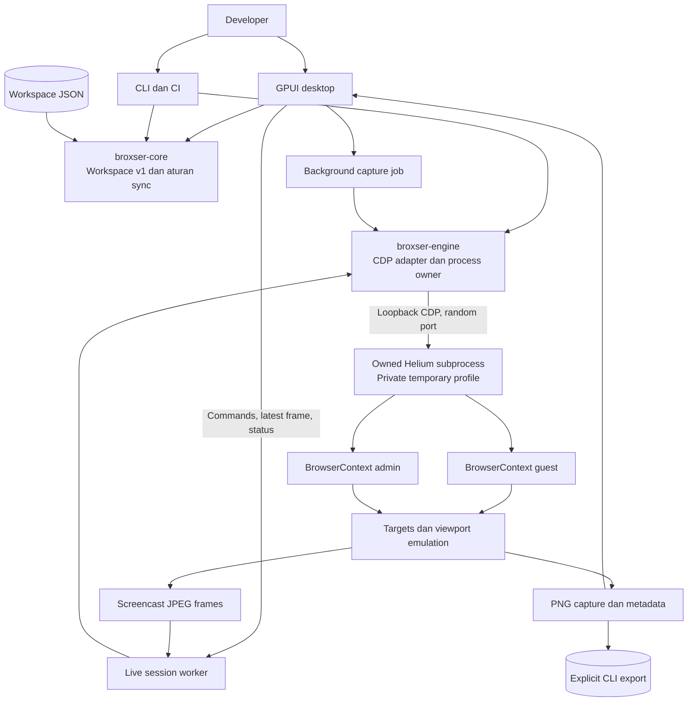

# Broxser System Design

Status: proposed, foundation implemented. Target pertama: Linux x86_64, Wayland
dan X11. Horizon perawatan: 2026–2036. Tanggal keputusan: 24 September 2026.
Owner yang diusulkan: Developer Experience, dengan satu maintainer utama dan satu
backup yang perlu ditunjuk perusahaan. Dokumen ini mengikuti struktur template
System Design; [versi Word](system-design.docx) adalah snapshot untuk review.
Perubahan desain selanjutnya harus memperbarui dokumen dan ADR terkait.

> **Snapshot Word perlu diselaraskan.** Sejak M0 reliability dan spike M1
> (24 September 2026) Markdown ini diperbarui di lingkungan tanpa renderer dokumen;
> DOCX belum diubah atau dirender ulang dan tidak mencerminkan ADR 0004–0007.

## 1. Abstract

Broxser membantu developer memeriksa satu aplikasi web pada beberapa viewport dan
session dalam satu workspace lokal. Implementasi dimulai sebagai modular monolith
Rust: GPUI menampilkan UI native, domain mengatur konfigurasi dan aturan sinkronisasi,
sedangkan adapter CDP mengendalikan proses Helium milik aplikasi. Engine dapat
diganti tanpa mengubah format workspace maupun model domain.

Spike M1 menampilkan **frame live** (CDP screencast) dari browser sungguhan dengan
URL bar, input per device dan sync opt-in, di samping capture PNG statis. Ini frame
streaming ke window native, belum browser tertanam, dan belum menggantikan seluruh
workflow Sizzy. Keberhasilan tahap berikutnya ditentukan oleh bukti input, rendering,
accessibility, keamanan, dan biaya perawatan; kesamaan tampilan saja tidak cukup.

## 2. Goals and non-goals

| Sasaran | Kriteria penerimaan |
| --- | --- |
| Pemeriksaan responsif lokal | URL yang sama ditangkap pada 3 viewport dan dimensinya benar |
| Pemisahan identitas | Session berbeda tidak berbagi cookie; device dengan session sama dapat berbagi |
| Stack yang diminta | UI GPUI nyata dan smoke test binary Helium Linux yang diketahui versinya |
| Data dapat dipindahkan | Workspace JSON v1 bisa ditinjau di Git, tanpa cookie atau password |
| Perawatan berkelanjutan | Runtime versioned, adapter terpisah, owner update, contract test dan rollback |

Rilis awal tidak mencakup engine web baru, fork Chromium besar, cloud sync,
collaborative browsing, terminal, AI agent, API client, extension marketplace,
rekaman video, persistent login, atau kemampuan menguji Safari hanya dengan
mengganti ukuran layar. macOS disiapkan melalui batas modul, tetapi belum didukung
atau diuji sebagai target rilis. Windows belum menjadi komitmen.

## 3. Background and problem statement

Tim ingin mengurangi biaya subscription dan perpindahan alat ketika membangun web.
[Sizzy](https://sizzy.co/) menjadi referensi kebutuhan: beberapa device, session,
workspace, debugging dan screenshot. Prioritas awal dipersempit ke loop responsif
yang dapat dibuktikan dan dirawat oleh tim internal.

[GPUI](https://gpui.rs/) menyediakan UI native Rust. [Helium](https://helium.computer/)
adalah browser berbasis Chromium. Pada dokumentasi/repository yang ditinjau, tidak
ditemukan SDK embedding Helium publik. Ini hasil penelusuran, bukan jaminan upstream.
Menghubungkan hasil CDP ke gambar GPUI adalah jalur proof yang konkret; menganggap
Helium sebagai widget webview siap pakai akan menyembunyikan pekerjaan terbesar.

File `Sizzy-75.5.0-arm64.dmg` milik pengguna merupakan distribusi macOS, sedangkan
host pengembangan Linux. Referensi kebutuhan berasal dari situs publik. Tidak ada
source, aset, atau mekanisme lisensi Sizzy yang diambil ke repo.

## 4. Proposed architecture

| Komponen | Tanggung jawab dan batas | Kegagalan |
| --- | --- | --- |
| `broxser-core` | Validasi, workspace v1, pure sync routing; tanpa UI/network | Input ditolak sebelum browser dimulai |
| `broxser-engine` | Proses browser dan guardian-nya, lease profil, CDP, emulasi, capture dan gate ekstensi | Error terbatas waktu dan dapat dibatalkan; child dan profil dihapus, oleh guardian bila proses Broxser mati |
| `broxser-desktop` | State UI, frame live, input, sync toggle, mode statis | Tampilkan status; tutup window setelah cleanup |
| `broxser-cli` | Validasi, bootstrap config, capture untuk otomasi | Exit nonzero; tidak menyatakan capture sukses |
| Helium | Network, DOM/CSS/JS, storage, sandbox Chromium | Hentikan job; jangan replay aksi pengguna |

Satu proses browser per capture job atau per workspace live yang terbuka, satu
BrowserContext per session, satu target per device. Device dengan session sama
sengaja berbagi konteks. Label `Admin` hanyalah nama session; tidak memberi hak
akses atau melakukan login.

GPUI tidak mengimpor tipe CDP. Domain tidak mengimpor GPUI atau adapter. Lapisan
adapter saat ini berupa API fungsi Rust; trait generik baru ditambahkan jika ada
adapter kedua yang nyata. Tidak ada service jaringan perusahaan yang harus hidup
agar fitur lokal bekerja.

## 5. Request lifecycle

1. Muat workspace maksimum 1 MiB, parse JSON, lalu validasi versi, URL, identitas,
   referensi session, viewport dan anggaran piksel.
2. Ambil executable Helium dari `BROXSER_HELIUM_BIN` atau PATH. `--browser` menerima
   pilihan eksplisit untuk pengujian. Jangan diam-diam beralih ke Chromium.
3. UI menjalankan capture di background, maksimal satu job aktif. Pulihkan profil
   stale di root yang sama, buat profil sementara privat (mode 0700) dengan lease
   pemilik, jalankan guardian dan tunggu sampai siap (ADR 0007), isi preferensi
   profil sebelum launch (blocker bawaan Helium tidak aktif di context session,
   ADR 0004), arahkan crash dump ke profil itu, lalu jalankan child browser dengan
   sandbox tetap aktif dan laporkan identitasnya ke guardian.
4. Baca `DevToolsActivePort` dari profil tersebut. Validasi port dan path, lalu
   hubungkan hanya ke `127.0.0.1`. Catat `Browser.getVersion` dan versi protokol.
5. Aktifkan target discovery, buat konteks session dan target, atur emulasi,
   navigasi, tunggu lifecycle load yang sesuai dengan navigation loader, lalu ambil
   PNG. Halaman ekstensi di context session menghentikan job. Navigasi yang
   digantikan navigasi lain dilaporkan beserta pemicunya (halaman atau browser).
   `load` bukan bukti SPA telah tenang; readiness selector dan network-idle adalah
   pengembangan lanjutan.
6. Kembalikan file capture dan metadata. UI menampilkan preview statis; CLI
   mengekspor PNG dan `report.json`. Hentikan browser, tunggu seluruh prosesnya
   keluar (identitas PID dan waktu mulai) sampai tidak ada proses yang masih
   menyebut profil, termasuk helper yang baru muncul saat browser berhenti, hapus
   profil sementara (lease terakhir), lalu lepaskan guardian.

Bila proses Broxser mati di langkah mana pun (SIGKILL, SIGTERM, crash), pipe ke
guardian tertutup oleh kernel. Guardian di session sendiri menghentikan browser
yang tercatat, menunggu helper-nya dan menghapus profil; bila guardian ikut mati,
start berikutnya di root yang sama menghapus profil yang terbukti stale dan
menghentikan browser yatim yang masih memakai profil itu. Keduanya tidak memutar
ulang aksi pengguna.

Live session memakai langkah 2–5 yang sama, lalu tetap hidup: worker memiliki
seluruh I/O CDP, UI hanya mengirim command ke antrean berbatas dan membaca status
serta satu frame terbaru per device. Frame di-ack saat diterima, termasuk yang
digantikan; device tersembunyi berhenti streaming. Crash renderer, target lepas,
browser keluar dan error transport menghasilkan state eksplisit. Restart adalah aksi
pengguna yang memulihkan konfigurasi dan memuat URL sekali (ADR 0005).

Window menjalankan satu transisi runtime pada satu waktu (ADR 0009). Restart hanya
ditawarkan untuk runtime yang berhenti atau gagal start, dan klik selama restart
atau close diabaikan, tidak diantrekan. Runtime baru dimulai hanya bila window tidak
memegang session, sehingga session yang berjalan tidak pernah di-drop di thread UI.
Close saat restart mengambil alih: runtime lama selesai berhenti di luar thread UI,
tidak ada browser yang dimulai, lalu window ditutup. Setiap runtime punya
generation; wake-up dan frame hasil decode dari generation lama dibuang tanpa
mengubah state runtime baru.

Keyboard mengikuti ADR 0010. Setiap key-down di window dicatat sebelum shortcut
dan elemen menanganinya; hanya key-down terakhir yang dihitung repeat, dan key-up
yang namanya berubah (Shift dilepas lebih dulu, karakter komposisi) mengakhiri
tekanan terakhir yang namanya dapat berubah. Key yang dilepas lebih awal di halaman
yang disembunyikan, tidak dipilih lagi atau kehilangan fokus tetap tercatat
ditekan, sehingga repeat-nya tidak masuk ke halaman lain. Engine tidak meneruskan
tombol yang oleh Helium dijadikan perintah browser (menutup tab atau window,
membuka tab, DevTools, reload, navigasi riwayat), tombol paste, maupun klik tengah;
clipboard dan selection buffer browser dipakai bersama semua session. Paste
menyisipkan teks clipboard sistem dengan `Input.insertText` ke device terpilih
yang terlihat.

ADR 0011 menambahkan input handler native pada canvas device terpilih. Preedit
memakai `Input.imeSetComposition`, commit memakai `Input.insertText`, dan teks
commit tidak masuk pencatatan tombol fisik atau menunggu key-up. Komposisi terikat
ke device, token editable engine dan generation runtime. Observer main frame
terisolasi mengirim identitas fokus dan geometri caret yang divalidasi, tanpa
menyalin teks halaman ke host. Geometri CSS dipetakan melalui batas frame yang
benar-benar dilukis, termasuk zoom, untuk posisi kandidat IME. Komposisi yang
kehilangan target dibatalkan; callback lama tidak boleh diteruskan ke device baru.
Password, iframe, closed shadow root, editor canvas dan penggantian surrounding
text belum dicakup. GPUI 0.2.2 dipertahankan sebagai source vendored dengan patch
commit ASCII Wayland agar semua commit melewati input handler native.

Startup dibatasi 15 detik, setiap command 15 detik dan load 30 detik. Ini deadline
per operasi, bukan SLA total job. Cancellation dicek paling lambat setiap 500 ms;
menutup window membatalkan capture dan menunggu cleanup. Deadline global job masih
gate pilot. Tidak ada retry otomatis untuk navigasi atau aksi yang mungkin memberi
efek samping.

Di live session setiap command punya deadline dan milik satu device atau browser
(ADR 0008). Navigasi yang dimulai Broxser (Go, Reload, sync, membuka workspace)
yang belum commit, gagal atau berhenti dalam 30 detik dihentikan seperti tombol
Stop dan dilaporkan pada device-nya, tanpa diulang; navigasi baru menggantikan
yang lama. Reload mengikuti loader main frame: navigasi dokumen baru dengan
loader berbeda mengakhiri deadline reload lama, sedangkan perubahan URL melalui
History API tidak membuktikan request reload telah selesai. Device yang
meninggalkan 32 event input tak terjawab, atau tidak
menjawab input selama 15 detik, dilaporkan *not responding*; input baru untuknya
dibuang, tidak diantrekan atau dikirim belakangan, sampai halaman menjawab lagi.
Batas per device menjumlah ke tabel runtime, sehingga device lain tetap berjalan.
Command yang dijawab proses browser sendiri harus terjawab dalam 15 detik; bila
tidak, runtime berhenti dengan error eksplisit. Jawaban command yang tidak lagi
ditunggu dibuang saat tiba.

## 6. API and data contracts

| Kontrak | Makna |
| --- | --- |
| `Workspace.schema_version` | Harus 1; versi masa depan ditolak |
| `name`, `url` | Nama manusia; URL HTTP/HTTPS tanpa userinfo |
| `sessions[]` | ID slug unik dan label; 1–8 session |
| `devices[]` | ID unik, dimensi CSS, DPR, mobile/touch dan referensi session |
| `capture_workspace` | Blocking Rust API; menerima workspace tervalidasi, executable, direktori output |
| `CaptureReport` | Browser product, protocol version, daftar file dan ukuran PNG aktual |
| `SyncRouter` | Aturan pure opt-in untuk scope dan pencegahan replay; dipakai live session untuk link dan scroll |
| `LiveSession` | Worker per workspace; `Command`, `Status` dan `Frame` tanpa tipe GPUI atau payload CDP |

Schema contoh: [examples/workspace.json](../examples/workspace.json). Definisi
otoritatif berikut validasinya berada di
[broxser-core](../crates/broxser-core/src/lib.rs). Viewport 200–4096 per sumbu,
DPR 0.5–4 yang finite, maksimal 8 device, total maksimum 24 juta piksel fisik.
Ukuran PNG berbeda dari CSS pixel ketika DPR bukan 1. User agent tidak otomatis
diubah menjadi iPhone: mobile emulation bukan simulasi Safari maupun hardware.

Konfigurasi tidak memuat cookies, headers rahasia, token atau profil browser.
Writer memakai file sementara di direktori yang sama dan rename; import versi baru
memerlukan migrasi eksplisit dengan backup dan validasi. Saat ini hanya v1 tersedia;
belum ada migrasi historis. Untuk state aplikasi yang berkembang, evaluasi SQLite
setelah kebutuhan query/transaksi nyata muncul, tetap sediakan ekspor JSON.

## 7. Consistency idempotency and replay

Satu capture menggunakan snapshot workspace yang tetap. Refresh berikutnya membuat
browser dan session baru; login tidak bertahan. Gambar adalah hasil pengamatan,
bukan salinan state aplikasi web yang bisa dipulihkan.

| Kejadian | Perilaku yang disyaratkan |
| --- | --- |
| Event sync duplikat/out-of-order | Tolak sequence lama pada origin; replay tidak disiarkan lagi |
| Session tujuan berbeda | Jangan kirim event tanpa keputusan produk dan izin baru |
| Job capture gagal sebagian | Laporkan gagal; file yang sempat dibuat bukan report sukses baru |
| Browser restart | Pulihkan konfigurasi; minta aksi pengguna untuk aktivitas yang dapat mengubah data |
| Restart dan close bersamaan | Satu transisi pada satu waktu; tidak ada browser baru setelah close; hasil runtime lama dibuang (ADR 0009) |
| Config berubah saat capture | Selesaikan snapshot aktif, pakai perubahan pada job berikutnya |

Router memerlukan opt-in, memeriksa source session/device, dan tidak mengaktifkan
click/typing. Live session memerlukan bukti aktivasi link tepercaya dari execution
context terisolasi pada main frame, lalu mencocokkannya dengan request dan loader
navigasi (ADR 0006). Respons HTTP lambat tidak menghapus kelayakan yang sudah
terikat ke navigasi itu. URL asli divalidasi tanpa dipotong. Yang disinkronkan
adalah URL link yang diaktifkan pengguna: peer memuatnya dan mengikuti redirect-nya
sendiri, sedangkan URL hasil redirect (yang bisa memuat kode atau token) hanya
tampil di status device itu. Navigasi same-document (hash, History API, Navigation
API) ke URL aktivasi link yang masih hidup (dokumen sama, dalam 10 detik) ikut
disinkronkan sekali; navigasi subframe, navigasi yang dimulai script, dan navigasi
tanpa dokumen tidak (ADR 0013). Scroll di-coalesce dan dibuang bila tujuan sudah
bernavigasi atau tersembunyi. Device tersembunyi tidak menerima input atau sync. Antrean
command, frame dan event berbatas. Jangan memakai klaim exactly-once untuk aksi
web; side effect di server tidak bisa dibatalkan oleh router lokal.

## 8. Security and privacy considerations

Halaman web adalah input tidak tepercaya; jangan beri akses filesystem, shell,
native app atau credential melalui bridge. CDP memiliki hak penuh atas browser
child; loopback mengurangi paparan jaringan, tetapi tidak mengautentikasi proses
lokal lain. Evaluasi transport pipe sebelum rollout luas untuk membatasi akses CDP
lokal. Kematian proses Broxser ditangani guardian per browser dan lease profil
(ADR 0007): browser, endpoint CDP dan profil hilang dalam batas lima detik yang
terukur di tes; bila guardian ikut mati, profil stale dipulihkan pada start
berikutnya di root yang sama. Profil dibuat dengan mode 0700; profil pribadi
pengguna tidak boleh dipakai. Crash dump diarahkan ke profil privat, sedangkan
database sertifikat NSS bersama masih dibuka Chromium. Core dump kernel dibatasi
(soft `RLIMIT_CORE` dan `coredump_filter` 0, diwarisi browser): dump tidak memuat
memori renderer, sehingga cookie dan isi halaman tidak sampai ke systemd-coredump
atau apport, dan crash renderer tidak tertahan di jalur dump. Jangan menambahkan
`--no-sandbox`, wildcard debug origins, atau mengabaikan sertifikat untuk
memudahkan test.

HTTP localhost dan jaringan internal sengaja didukung. Validasi URL awal bukan
allowlist redirect; CLI bukan layanan URL-fetch publik. Upstream browser tetap
menentukan permission dan network behavior. Capture bisa berisi data sensitif;
ekspor dipicu pengguna dan tidak diunggah otomatis. Git mengabaikan profil, capture,
runtime dan `.env`. Tidak ada endpoint analytics aplikasi.

Helium memiliki privacy/filter defaults yang dapat memengaruhi aplikasi uji.
Blocker bawaannya me-reload tab di context baru sehingga dimatikan di session
Broxser (ADR 0004); halaman session tidak memakai content blocking. Default lain,
seperti fingerprint noise, masih perlu dievaluasi sebelum dipakai sebagai browser QA
utama; headless tidak boleh diasumsikan identik dengan mode interaktif/extension.
Review lisensi dilakukan sebelum packaging; [NOTICE.md](../NOTICE.md) merangkum
status tanpa menganggap pemisahan proses menghapus kewajiban distribusi.

## 9. Operational readiness and ten year stewardship

Sepuluh tahun adalah horizon kepemilikan produk, bukan janji umur API GPUI/Helium.
Pertahankan core dan kontrak data yang kecil, serta kemampuan mengganti adapter.

| Area | Target usulan dan gate | Owner yang harus ditunjuk |
| --- | --- | --- |
| Browser security | Triage advisory 1 hari kerja; critical update 72 jam setelah upstream layak | Engine maintainer + backup |
| Update normal | Review mingguan; kualifikasi runtime bulanan; UI/deps per kuartal | Maintainer |
| Correctness | Viewport, cookie/storage isolation, lifecycle dan cleanup lulus | QA/engine |
| UI latency | p95 respons input <50 ms pada laptop referensi | UI maintainer |
| Capture | 3 fixture viewport <5 detik warm sebagai target | Engine maintainer |
| Memory | Tambahan UI idle <150 MB; total fixture <1.5 GB sebagai target | UI/engine |
| Release | Checksum, inventory lisensi, SBOM, signing dan rollback teruji | Release owner |

Angka performa adalah target awal, **belum hasil benchmark**. Definisikan laptop
16 GB, distro/GPU/driver, 3 viewport DPR1 dan fixture yang sama sebelum mengukur.
Browser halaman dunia nyata bisa memakai jauh lebih banyak memori; batas piksel
bukan hard memory limit. Device yang ter-scroll keluar canvas kini menjeda
screencast-nya (ADR 0012); di kontainer software-rendering hal itu menurunkan CPU
browser 8 device beranimasi dari 170% ke 97%. Kualifikasi pada hardware referensi
masih diperlukan sebelum 8 device dipakai sebagai fitur production.

Cargo.lock, Rust toolchain, GPUI exact version dan checksum Helium memberi baseline
yang dapat direproduksi. Dependabot membantu Rust/action; pembaruan browser tetap
pekerjaan owner dengan contract test. CI memeriksa compile dan headless integration;
matrix GPU Wayland/X11, fractional scale, IME dan accessibility memerlukan test
desktop nyata sebelum rilis.

Canary awal: 5 developer selama 2 minggu, setelah fungsionalitas hariannya tersedia.
Promosi membutuhkan tidak ada bug kehilangan data/isolation, capture/navigation
workflow yang teruji, update engine dan rollback yang pernah dipraktikkan. Jangan
rollback ke runtime yang punya kerentanan kritis tanpa containment; perbaikan maju
dapat lebih aman. Simpan config backup sebelum migrasi, jangan downgrade profile
browser lintas versi sembarangan.

Tahun 1 fokus loop inti dan release discipline; tahun 2–3 hardening dan pengurangan
support load; tahun 4–6 evaluasi ulang API renderer, kebutuhan platform dan format
data; tahun 7–10 ganti komponen yang usang melalui kontrak yang sama. Review desain
tahunan berdasarkan penggunaan dan biaya, bukan roadmap sepuluh tahun yang kaku.

TCO tahunan = jam engineering × loaded cost + CI/signing/storage/support.
Penghematan kotor = jumlah seat × harga subscription tahunan aktual.
Jumlah seat, tarif tim dan biaya vendor belum diberikan; belum ada klaim bahwa
build sendiri pasti lebih murah. Putuskan scale-up setelah pilot mengukur waktu
yang dihemat dan beban maintenance.

## 10. Alternatives considered

| Alternatif | Tradeoff dan keputusan |
| --- | --- |
| GPUI + external Helium CDP | Dipilih untuk proof; batas runtime jelas, input/native integration masih perlu kerja |
| Fork penuh UI/Chromium Helium | Integrasi surface lebih langsung, tetapi merge/security/build ownership jauh lebih besar; tunda |
| CEF atau hostable Chromium surface | Kandidat spike embedding jika CDP gagal memenuhi UX; bukan identik dengan runtime Helium |
| Tauri/system webview | Lebih mudah untuk aplikasi biasa; tidak memenuhi pilihan GPUI dan engine konsisten yang diminta |
| Electron/Playwright frontend | Ekosistem matang untuk otomasi; bukan stack produk yang dipilih |
| Tetap memakai Sizzy | Tetap opsi ekonomi saat maintenance internal melebihi penghematan |

## 11. Open questions

- Siapa primary/backup owner dengan kapasitas maintenance nyata, dan berapa seat tim?
- Distro, GPU, fractional scaling, accessibility dan aplikasi perusahaan apa yang wajib lulus?
- Apakah kebutuhan utama preview responsif atau interaksi web lengkap? Gate ini
  menentukan apakah CDP cukup atau perlu investasi embedding terpisah.
- Apakah Helium filtering/fingerprinting behavior dapat dikonfigurasi agar hasil QA representatif?
- Bagaimana secret store, persistent session, signed package dan distribusi internal akan dikelola?

## 12. Decision and next steps

| Milestone | Hasil | Exit criteria |
| --- | --- | --- |
| M0 foundation | Repo, GPUI shell, validasi, real Helium capture, dokumentasi | Compile/test dan bukti Linux capture/isolation; status keterbatasan jelas |
| M0 reliability | Reproducer slow-page, penyebab `ERR_ABORTED`, tes lifecycle/cleanup | Error dapat dijelaskan tanpa retry; tes dapat diulang; cleanup normal/error terbukti |
| M1 interactive spike | Frame transport, navigation/scroll sync, coordinate/input mapping | Resize/DPR/IME/clipboard/popups/a11y dan latency memenuhi gate; ADR lanjut atau ganti integrasi |
| M2 daily workflow pilot | Persistent session aman, console, capture/export, crash recovery | 5 developer 2 minggu, update/rollback rehearsal dan tidak ada isolation/data-loss bug |
| M3 Linux rollout | Packaging/signing/support, resource control dan release ownership | Workflow pengganti Sizzy diverifikasi tim; biaya maintenance terukur |
| M4 optional platforms | macOS lalu target lain sesuai permintaan | Test/packaging platform tersendiri, tanpa klaim dukungan dari kompilasi saja |

Status 24 September 2026: M0 reliability lulus dengan bukti cloud dan CI. Spike M1
berjalan (ADR 0005) dan lulus tes live serta pemeriksaan window X11 di cloud; checklist
desktop Wayland/GPU, latency, HiDPI, IME, clipboard, popup dan aksesibilitas belum.

Status 25 September 2026: P0 cleanup saat proses induk mati diimplementasikan
(ADR 0007) dan lulus reproducer fake browser, Helium live, CLI serta window X11 di
cloud. Preview mode statis dan direktori socket Chromium di temp dir belum tercakup;
kualifikasi pada desktop dan distro perusahaan masih diperlukan.

Status 26 September 2026: P1.1 (ADR 0008) dan P1.2 (ADR 0009) sudah di-merge. P1.3
keyboard, tombol browser dan paste eksplisit (ADR 0010) lulus tes Helium live dan
window X11 dengan layout US dan Jerman; komposisi IME dan copy ke clipboard sistem
belum, dan daftar tombol browser harus diukur ulang pada setiap update Helium.

Keputusan saat ini: lanjutkan foundation dan bukti integrasi, pertahankan runtime
eksternal dan konfigurasi portabel. Full embedding perlu keputusan baru berdasarkan
hasil M1. Penonaktifan subscription Sizzy sebaiknya mengikuti bukti workflow M2,
bukan hanya keberhasilan build starter.

## Sources

Ditinjau 24 September 2026. Dokumen upstream dapat berubah; versi implementation
dikunci di repo dan runtime manifest.

- [Sizzy capabilities](https://sizzy.co/)
- [GPUI introduction](https://gpui.rs/) dan [published 0.2.2](https://crates.io/crates/gpui/0.2.2)
- [Helium source and license](https://github.com/imputnet/helium)
- [Helium Linux baseline 0.18.1.1](https://github.com/imputnet/helium-linux/releases/tag/0.18.1.1)
- [Chrome headless](https://developer.chrome.com/docs/automation-and-testing/headless)
- [Remote debugging and private profiles](https://developer.chrome.com/blog/remote-debugging-port)
- [CDP Target](https://chromedevtools.github.io/devtools-protocol/tot/Target/), [CDP Page](https://chromedevtools.github.io/devtools-protocol/tot/Page/) dan [CDP Input](https://chromedevtools.github.io/devtools-protocol/tot/Input/)
